# API Reference
- [Tune Pipeline](#tune-pipeline)
- [Class Diagram](#class-diagram)
- [Constants and definitions](#constants-and-definitions)
- [`TunePlayer` Class](#tuneplayer-class)
- [`BaseTuneLoader` Abstract Class](#basetuneloader-abstract-class)
    - [`FlashTuneLoader` Derived Class](#flashtuneloader-derived-class)
    - [`EEPROMTuneLoader` Derived Class](#eepromtuneloader-derived-class)
    - [`RAMTuneLoader` Derived Class](#ramtuneloader-deried-class)
- [`SoundGenerator` Abstract Class](#soundgenerator-abstract-class)
    - [`ToneSound` Derived Class](#tonesound-derived-class)
    - [`TimerOneSound` Derived Class](#timeronesound-derived-class)

For more info, feel free to look at the class diagram, examples and [source code](../src), or create an issue.

## Tune Pipeline
TODO

## Class Diagram
Excuse the probably not proper arrows, but better than nothing.


## Constants and definitions
If needed, define these before including `TunePlayer.h`.

|   Definition    | Comment                                                                                                                                                                                                                                                                                                                  | Default value |
|:---------------:|:-------------------------------------------------------------------------------------------------------------------------------------------------------------------------------------------------------------------------------------------------------------------------------------------------------------------------|:-------------:|
| `MANUAL_CUTOFF` | If defined, the `stopSound` method of the `SoundGenerator` object will be called whenever the note ends. This is not necessary for implementations that stop sound automatically like `ToneSound`, but is required for the likes of `TimerOnesound` that will keep playing until stopped.                                |   Undefined   |
| `PRECISE_FREQS` | If defined and using `ToneSound`, every single frequency of each note is stored as an array and loaded. This is still limited to integer values, but may be sometimes marginally more accurate than the default method of halving from an array containing only the highest notes, although a lot less memory efficient. |   Undefined   |

## `TunePlayer` Class
This class does handles interpreting notes given by a `TuneLoader` class, timing and passing the correct note to play on to a `SoundGenerator` object.

#### Constructor
###### Example
No parameters given.
```c++
TunePlayer tune;
```

#### Attributes
|       Name       |     Data Type     | Comments                                                                                  | Should be written to |   Default   |
|:----------------:|:-----------------:|:------------------------------------------------------------------------------------------|:--------------------:|:-----------:|
|   `tuneLoader`   | `BaseTuneLoader*` | Pointer to an object that can load and return notes to play                               |         yes          | unspecified |
| `soundGenerator` | `SoundGenerator*` | Pointer to an object that can turn notes into sound.                                      |         yes          | unspecified |
|   `isPlaying`    |      `bool`       | `true` when a tune is currently being played, `false` otherwise (when stopped or paused). |          no          |   `false`   |

#### Methods
##### `void begin(BaseTuneLoader *newTuneLoader, SoundGenerator *newSoundGenerator)`
Initialises the library with the given parameters. Sets `tuneLoader` and `soundGenerator`.
Also initialises `soundGenerator` and `tuneLoader` by calling their `begin` methods.

##### `void begin()`
Initialises `soundGenerator` and `tuneLoader` by calling their `begin` methods. `soundGenerator` and `tuneLoader` need to be set before this method is called, or can be passed as parameters (see above).

##### `void spool()`
Fills up the queue of notes for playback, ready for a fast response from calling `play()` to sound actually coming out.

##### `void play()`
Enables playback of the tune. Playback will start on the next call to `update()`.

##### `void update()`
Performs all housekeeping operations necessary for tune loading and playback. This should be called as often as possible.

##### `void pause(bool holdNote = false)`
Stops making noise, but keeps the queue of notes and pointers to the next note. This means that `play` can be called and the tune will keep playing from the next note after the one on which the tune was paused.

If `holdNote` is `true`, the note will be played for its normal time (not cut off immediately), or for `SoundGenerators` that do not stop automatically like `TimerOneSound`, will keep playing forever.
##### `void stop()`
Stops making noise, clears the queue of notes and resets the notes address back to the start of the song. This means on calling `play` next time, the tune will restart from the beginning.

Calling `stop` can also be used when changing tunes - see the [jukebox example](../examples/jukebox/jukebox.ino).

## `BaseTuneLoader` Abstract Class
Helper classes for `TunePlayer` that help with loading of notes from required sources. Each loader should inherrit `BaseTuneLoader` and have the `loadNote` method at least.

#### Attributes
None

#### Methods
##### `virtual void begin()`
Placeholder for if there is any initialisation required.

##### `virtual uint16_t loadNote(uint16_t address)`
Placeholder for the method that loads a 2 byte integer at address `address` in the song and returns it. For example, the first note is address 0, second is address 1...

### `FlashTuneLoader` Derived Class
Uses the `PROGMEM` feature of AVR chips to load tunes stored in the program memory.

TODO

### `EEPROMTuneLoader` Derived Class
TODO
<br>**NOTE:** NOT IMPLEMENTED YET!!!

### `RAMTuneLoader` Derived Class
TODO
<br>**NOTE:** NOT IMPLEMENTED YET!!!