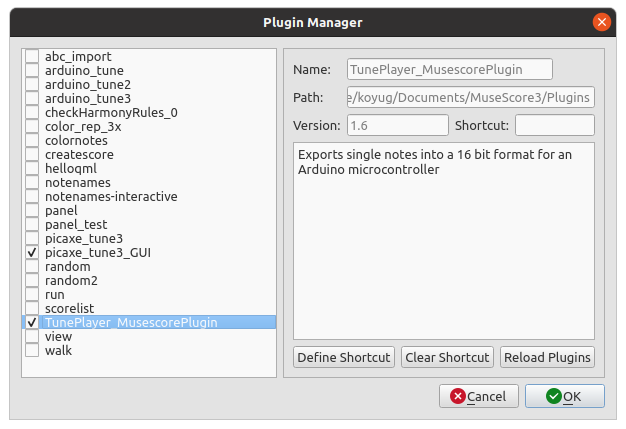
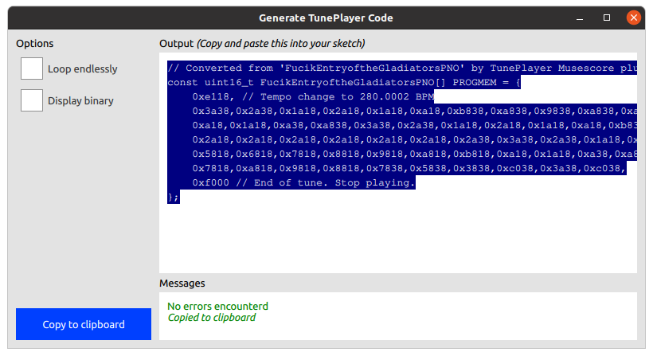

# TunePlayer Musescore3 Plugin
This plugin allows suitable sheet music to be easily converted into a format that TunePlayer can use.

## Installation
Copy or symlink the [TunePlayer_MusescorePlugin.qml](TunePlayer_MusescorePlugin.qml) file to the plugins folder in Musescore 3 (in my case *~/Documents/Musescore3/Plugins*). 

Open the plugin manager in *Plugins > Plugin Manager* and tick *TunePlayer_MusescorePlugin*.

## Running the plugin
Open the score you want to conver. For best results, the score should have only a single instruement and only one note at a time (no chords). See [here](songs) for examples of suitable files.

Navigate to *Plugins > Generate TunePlayer Code* and click it. This should bring up a window as shown below.

The tune can be made to restart from the beginning when it finishes by ticking the *Loop endlessly* checkbox. For easier debugging or learning how the notes are structured, *Display binary* will show all numbers as binary instead of hex.

The code can be copied to the clipboard by clicking the blue *Copy to cplipboard* button or clicking on the text area a couple of times.