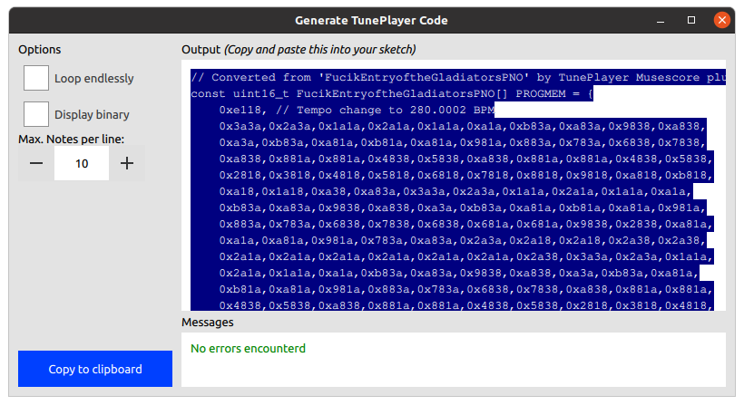
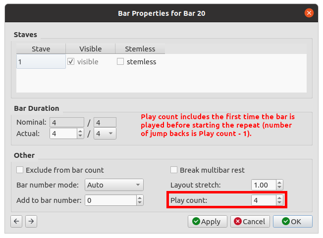

# TunePlayer Musescore3 Plugin
This plugin allows suitable sheet music to be easily converted into a format that TunePlayer can use.

## Installation
Copy or symlink the [TunePlayer_MusescorePlugin.qml](TunePlayer_MusescorePlugin.qml) file to the plugins folder in Musescore 3 (in my case *~/Documents/Musescore3/Plugins*). 

Open the plugin manager in *Plugins > Plugin Manager* and tick *TunePlayer_MusescorePlugin*.

## Running the plugin
Open the score you want to convert. See [here](songs) for examples of suitable files and have a look at the [supported functionality](#supported-functionality)

Navigate to *Plugins > Generate TunePlayer Code* and click it. This should bring up a window as shown below.

The tune can be made to restart from the beginning when it finishes by ticking the *Loop endlessly* checkbox. For easier debugging or learning how the notes are structured, *Display binary* will show all numbers as binary instead of hexadecimal.

The maximum number of notes that will be put on one line (code formatting) can be set using the *Notes per line* number entry.

The code can be copied to the clipboard by clicking the blue *Copy to clipboard* button or clicking on the text area a couple of times.

## Supported functionality
For best results, the score should have only a single instruement and only one note at a time (no chords). Individual notes can be up to *8* beats in *1/8* beat (demisemiquaver) resolution or *64/12* beats in *1/12* beat resolution (useful for triplets).

Slurs and ties are supported, as are staccarto effects (dotting notes).

The tempo can also be set using the tempo options in the pallete. Setting the tempo and time signature can also be used as a hack for any other weird note lengths not supported.

Repeats are implemented using standard repeat barlines (`:||`, `||:` and `:||:` as ACSI art representations). If a section is to be reated more than once at a time, then the *Play count* can be set by right clicking on the bar with the repeat (`:||`), going to *Bar Properties* and setting the *Play count* (see screenshot below).

As a horrible sounding example of what is possible ([CompleteTest.mscz](songs/CompleteTest.mscz)):
