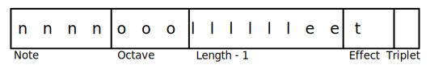
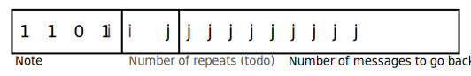
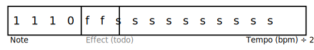
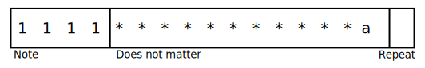

# Note Structure

## Overview
This page describes the ins and outs of how notes are formatted and stored. If you just want to make this library play something, this [Musescore plugin](MusescorePlugin.md) will automatically generate the required code.

Each note or instruction is a 16 bit (2 byte) integer. There are currently 4 main message types; a note or rest to play, a repeat instruction,  a set tempo instruction and an end of tune message.  All start with a 4 bit number,  representing the note to play or the instruction to follow and from this, how to read the following 12 bits. Values in the range 0 to 11 inclusive are instructions to play a note,  12 is a rest, 13 is a repeat, 14 is a new tempo to play at and 15 is the end of the tune.

Notes are stored in an array. Where and how this array is stored is flexible and can be changed by using a different loader class.

## Notes and rests

TODO: Describe

## Repeats

TODO: Describe

## Tempo setting

TODO: Describe

## End of tune

If the least significant bit, *a*, is 1, the tune will be repeated from the beginning. If this bit is a 0, the library will stop playing when it reaches the end.