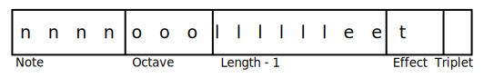
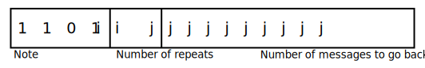
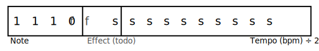
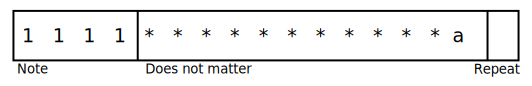

# Note Structure

## Overview
This page describes the ins and outs of how notes are formatted and stored. If you just want to make this library play something, this [Musescore plugin](MusescorePlugin.md) will automatically generate the required code, or this [calculator](NotesCalculator.html) for working on individual notes.

Each note or instruction is a 16 bit (2 byte) integer. There are currently 4 main message types; a note or rest to play, a repeat instruction,  a set tempo instruction and an end of tune message.  All start with a 4 bit number,  representing the note to play or the instruction to follow and from this, how to read the following 12 bits. Values in the range 0 to 11 inclusive are instructions to play a note,  12 is a rest, 13 is a repeat, 14 is a new tempo to play at and 15 is the end of the tune.

Notes are stored in an array. Where and how this array is stored is flexible and can be changed by using a different loader class.

[This](https://newt.phys.unsw.edu.au/jw/notes.html) is a useful website on midi notes and frequencies.

In general in the diagrams below, `1` represents an always on, true, 1, high... bit, `0` represents an always off, false, 0, low... bit and `*` does not matter and is currently not used. See the description below each diagram for italic letters.

## Notes and rests

  
Note (<i>n</i>)

A 4 bit number representing the note.

|         Note          | Number |  Binary  |
| :-------------------: | :----: | :------: |
|           C           |   0    | `0b0000` |
| C&#x266f; / D&#x266d; |   1    | `0b0001` |
|           D           |   2    | `0b0010` |
| D&#x266f; / E&#x266d; |   3    | `0b0011` |
|           E           |   4    | `0b0100` |
|           F           |   5    | `0b0101` |
| F&#x266f; / G&#x266d; |   6    | `0b0110` |
|           G           |   7    | `0b0111` |
| G&#x266f; / A&#x266d; |   8    | `0b1000` |
|           A           |   9    | `0b1001` |
| A&#x266f; / B&#x266d; |   10   | `0b1010` |
|           B           |   11   | `0b1011` |
|         Rest          |   12   | `0b1100` |

A midi note (0-127) can be converted to a note using

<i>note = midi % 12</i>

  
Octave (<i>o</i>)

A 3 bit number representing the octave.

| Octave | Binary  | Note Range |
| :----: | :-----: | :--------: |
|   0    | `0b000` |  C1 - B1   |
|   1    | `0b001` |  C2 - B2   |
|   2    | `0b010` |  C3 - B3   |
|   3    | `0b011` |  C4 - B4   |
|   4    | `0b100` |  C5 - B5   |
|   5    | `0b101` |  C6 - B6   |
|   6    | `0b110` |  C7 - B7   |
|   7    | `0b111` |  C8 - B8   |

A midi note (0-127) can be converted to an octave using

<i>octave = </i>floor<i>(midi / 12) - 2</i>

  
Length (<i>l</i>)

A 6 bit number representing the length of the note.

By default, the length is the number of *1/8th* beats *-1*. For example, a crotchet (*1/4* note) is *8/8* beats, so in this case the length would be *7*.

If the triplet mode bit is set, the length is now interpreted as the number of *1/12th* beats *-1*, allowing correct triplets to be represented.

  
Effect (<i>e</i>)

Two bits for effects such as staccarto and legato notes.

| Effect number | Binary |       Effect       | Fraction of note time played |
| :-----------: | :----: | :----------------: | :--------------------------: |
|       0       | `0b00` |        None        |           *7/8*\*            |
|       1       | `0b01` |      Staccato      |            *1/2*             |
|       2       | `0b10` |       Legato       |          Full time           |
|       3       | `0b11` | *Currently unused* |              -               |

\* According to the [PICAXE manual 2](https://picaxe.com/getting-started/picaxe-manuals/), *7/8* is the standard time for electronic music. From experimenting, attempting to play all notes for the full time just sounds weird and ties repeated notes.

  
Triplet mode (<i>t</i>)

If this is 0 (off), the length is interpreted as being in *1/8th* beats. If this is 1 (on), the length is interpreted as being in *1/12th* beats.

## Repeats

  
Number of repeats (<i>i</i>)

The number of times a section is repeated.

A options are:
| Value | Binary | Number of repeats                                      |
| :---: | :----: | :----------------------------------------------------- |
|   0   | `0b00` | Once only (the section is heard twice in a row)        |
|   1   | `0b01` | Repeat twice (the section is heard 3 times in a row)   |
|   2   | `0b10` | Repeat 3 times (the section is heard 4 times in a row) |
|   3   | `0b10` | Repeat every time (never go past here)                 |

  
Number of messages to go back (<i>j</i>)

The number of messages to go back.

## Tempo setting

  
Effect (todo) (<i>f</i>)

Not currently implemented

  
Tempo (<i>s</i>)

A 10 bit number representing the tempo in beats per minute.

## End of tune

  
Start over (<i>a</i>)

If the least significant bit, *a*, is 1, the tune will be repeated from the beginning. If this bit is a 0, the library will stop playing when it reaches the end.

