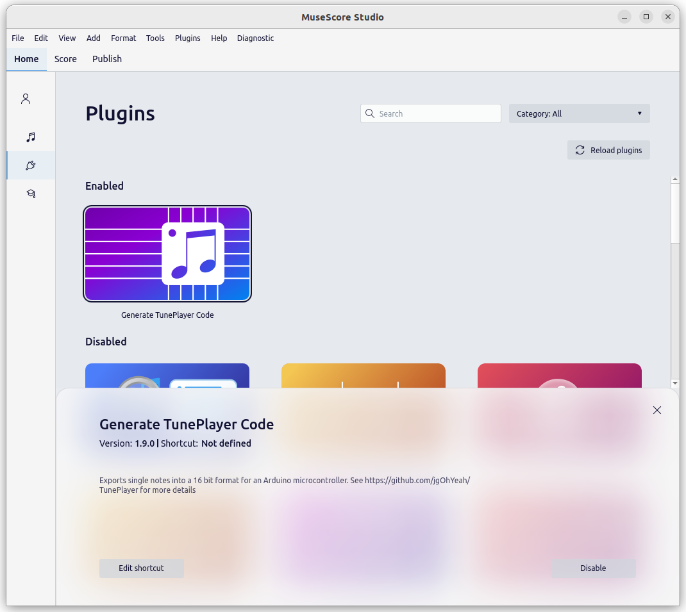
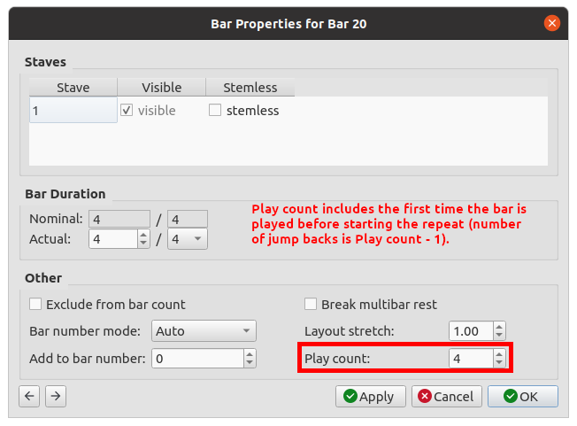
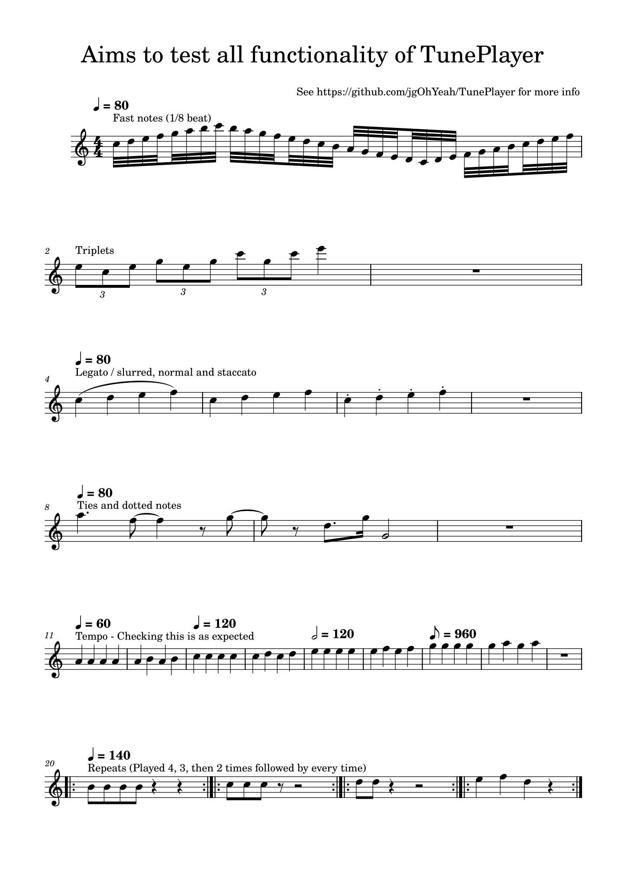

# TunePlayer MuseScore Plugin
This plugin allows suitable sheet music to be easily converted into a format that TunePlayer can use. It has been tested with MuseScore 3.6.2 and MuseScore 4.3.0.

See [here](https://github.com/jgOhYeah/TunePlayer) for more info on TunePlayer and updates.

## Installation
### MuseScore 3
Copy or symlink the [TunePlayer_MusescorePlugin.qml](TunePlayer_MusescorePlugin.qml) file to the plugins folder in MuseScore 3 (in my case *~/Documents/Musescore3/Plugins*).

Restart MuseScore if it was open. Open the plugin manager in *Plugins > Plugin Manager* and tick *TunePlayer_MusescorePlugin*.


### MuseScore 4
Copy the entire [TunePlayer_MusescorePlugin](./) folder containing [TunePlayer_MusescorePlugin.qml](TunePlayer_MusescorePlugin.qml) and [tuneplayer_logo.svg](tuneplayer_logo.svg) to the plugins folder in MuseScore 4. In my case:

```bash
rsync -r ~/Documents/Arduino/libraries/TunePlayer/extras/TunePlayer_MusescorePlugin ~/Documents/MuseScore4/Plugins/
```

Restart Musescore if it was open. Open the plugins tab (*Home > Plugins*) and click on the *Generate TunePlayer Code* extension. Make sure it is enabled.



## Running the plugin
Open the score you want to convert. See [here](../songs) for examples of suitable files and have a look at the [supported functionality](#supported-functionality)

Navigate to *Plugins > Generate TunePlayer Code* and click it. This should bring up a window as shown below.


The tune can be made to restart from the beginning when it finishes by ticking the *Loop endlessly* checkbox. For easier debugging or learning how the notes are structured, *Display binary* will show all numbers as binary instead of hexadecimal.

The maximum number of notes that will be put on one line (code formatting) can be set using the *Notes per line* number entry.

The code can be copied to the clipboard by clicking the blue *Copy to clipboard* button or clicking on the text area a couple of times.

## Supported functionality
### Note durations
For best results, the score should have only a single instrument and only one note at a time (no chords). Individual notes can be up to *8* beats in *1/8* beat (demisemiquaver) resolution or *64/12* beats in *1/12* beat resolution (useful for triplets). If an even longer note is needed, a slur can be used to join two notes together. A tie will be automatically converted into a single note and thus the maximum duration is limited.

### Note effects
Slurs and ties are supported, as are staccato effects (dotting notes). The maximum length of tied notes is limited as described [above](#note-durations).

### Tempo
The tempo can also be set using the tempo options in the pallet. Setting the tempo and time signature can also be used as a hack for any other weird note lengths not supported.

### Repeats
Repeats are implemented using standard repeat barlines (`:||`, `||:` and `:||:` as ASCII art representations). If a section is to be repeated more than once at a time, then the *Play count* can be set by right-clicking on the bar with the repeat (`:||`), going to *Bar Properties* and setting the *Play count* (see screenshot below).



As a horrible sounding example of what is possible ([CompleteTest.mscz](../songs/CompleteTest.mscz)):
